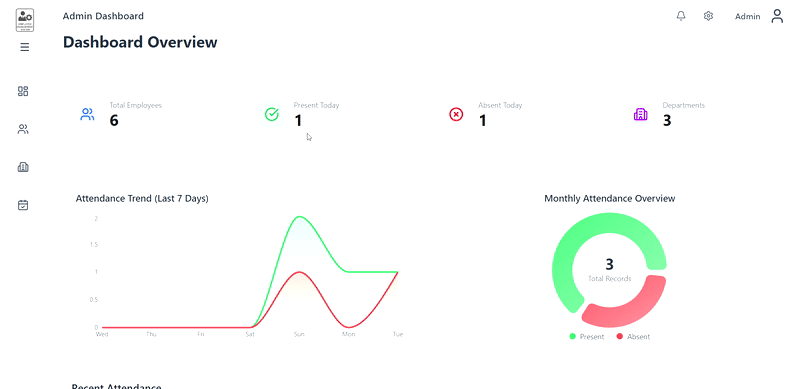
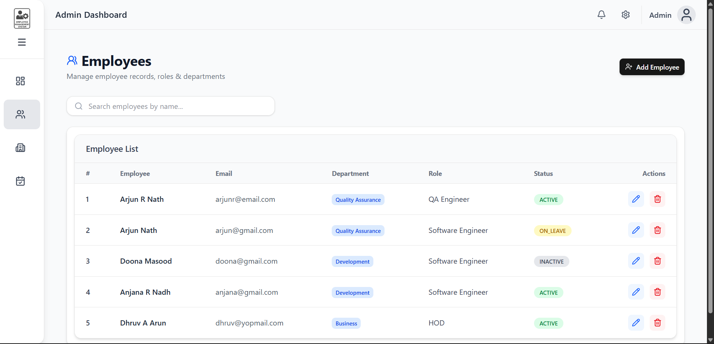
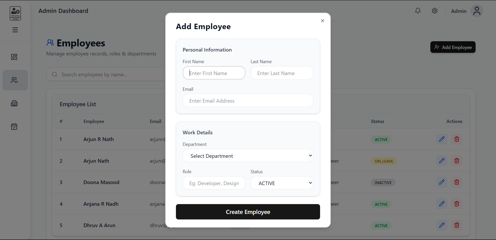
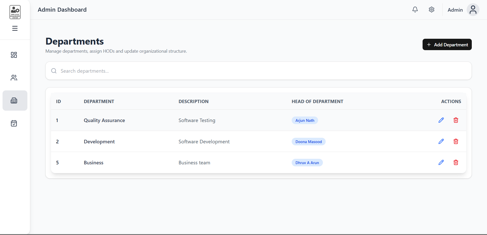
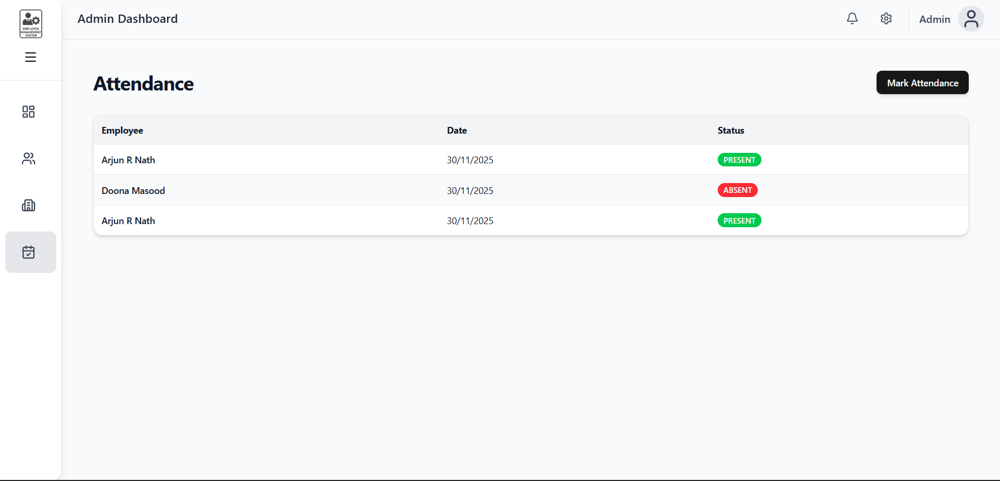

# 📌 Employee Management System – Frontend

[](https://reactjs.org/)
[](https://nodejs.org/)
[](LICENSE)

A **React-based frontend application** for managing employees, departments, and attendance.  
This frontend consumes the EMS backend APIs to provide a responsive and interactive UI for administrators.

---

## 🚀 Features

- **Employee Management**: View, add, edit, and delete employees  
- **Department Management**: View departments, add or update departments  
- **Attendance Dashboard**: Mark attendance, track present/absent employees  
- **Responsive UI**: Works on desktop, tablet, and mobile devices  
- **Dashboard Metrics**: Total employees, present, absent, and department-wise stats

---

## 🛠️ Tech Stack

- **Frontend:** React 18+  
- **State Management:** Context API  
- **UI Library:** Tailwind CSS + ShadCN UI  
- **HTTP Requests:** Axios  
- **Routing:** React Router  
- **Build Tools:** Vite  

---

## 📁 Project Structure

```
ems-frontend/
│── public/
│── src/
│     ├── assets/           # assets (images)
│     ├── components/       # Reusable UI components
│     ├── constants/        
│     ├── hooks/            # Reusable functional components
│     ├── pages/            # Pages (Dashboard, Employees, Departments, Attendance)
│     ├── services/         # API service files
│     ├── types/            # Entity types
│     ├── libs/             # Helper functions
│     ├── App.tsx
│     ├── index.css
│     └── main.tsx
│
├── package.json
└── README.md
```

---

## ⚙️ Setup & Installation

### 1️⃣ Clone Repository
```bash
git clone https://github.com/your-repo/ems-frontend.git
cd ems-frontend
```

### 2️⃣ Install Dependencies
```bash
npm install
# or
yarn install
```

### 3️⃣ Configure Environment Variables
Create a `.env` file in the root:

```env
REACT_APP_API_URL=http://localhost:8080
```

### 4️⃣ Start Development Server
```bash
npm start
# or
yarn start
```

Access the app at: `http://localhost:3000`

---

## 📚 API Integration

- **Employees:** `GET /api/employees`, `POST /api/employees`, `PUT /api/employees/{id}`, `DELETE /api/employees/{id}`  
- **Departments:** `GET /api/departments`, `POST /api/departments`  
- **Attendance:** `POST /api/attendance`, `GET /api/attendance/{employeeId}`  

All API calls handled via **Axios** in `src/services`.

---

## 🧪 Testing

- **Unit Tests:** Jest / React Testing Library  
- **Manual Testing:** Browser + Developer Tools  
- **API Testing:** Ensure backend is running  

---

## 🎨 Screenshots (Optional)








---

## 👤 Author

**Arjun R Nath**  
Junior Software Engineer Trainee – Armia Systems Pvt Ltd  
React | JavaScript | Full-Stack Development

---

## 📜 License

This project is licensed under the **MIT License**.
